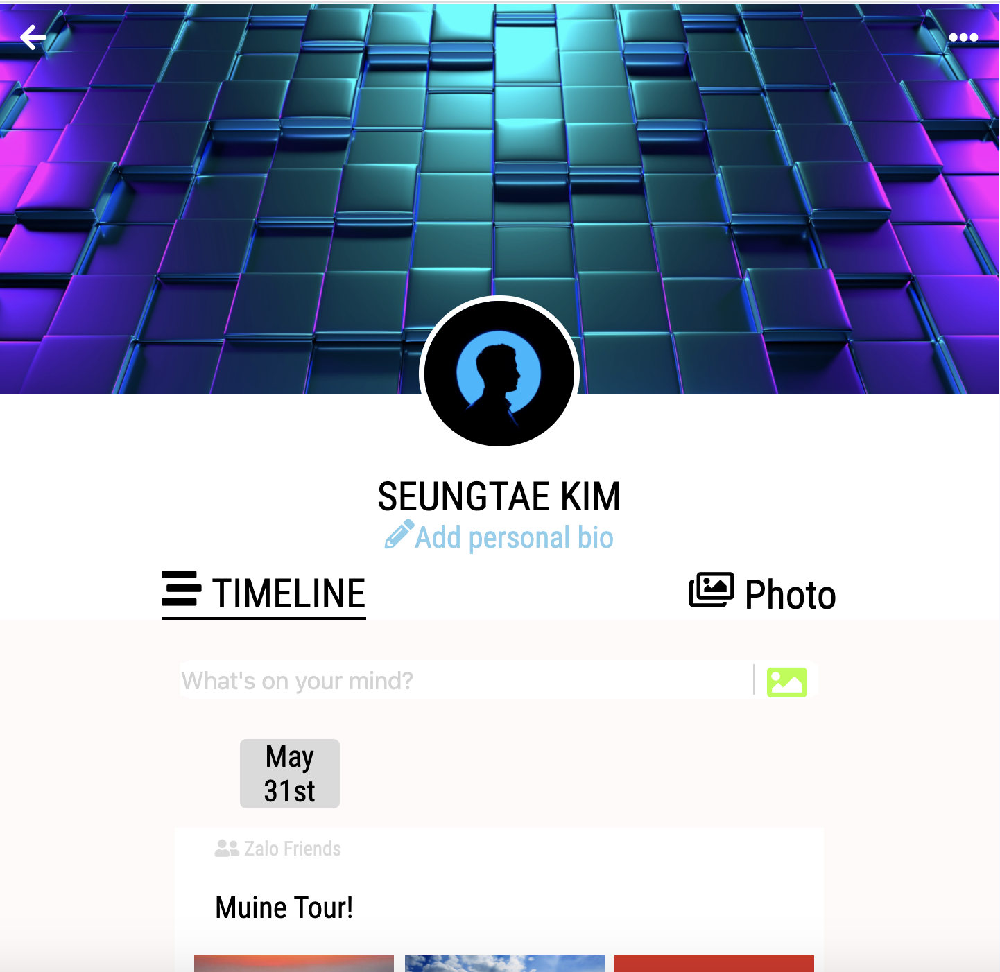

# 베트남인들을 대상으로한 무료 강의 세션 준비

## 클론하셔서 강의 자료로 활용하기 전에...

- 해당 클론 강의는 오픈 소스로 제작되어 무료로 활용하실 수 있습니다.
- 다만, 강의를 사용하시기 전에 해당 레포의 Star를 클릭해주시거나, 저작권을 밝혀주시는 일을 지켜주시면 감사하겠습니다.

## 1. 4월 15일 첫번째 무료 세션 진행

- 베트남인들을 대상으로 진행한 첫번째 무료 세션 진행
- 영어로 진행했고, 호치민 직장인 1기가 진행 중인 점, 그리고 1주일 안에 강의 자료를 뽑아내야만 했던 상황인 점을 감안해서 과감하게 유튜브 컨텐츠를 활용하기로 결정
- 베트남 내에서 코로나로 인해 호치민, 하노이가 도시 봉쇄당한 상태여서 오프라인 강의 진행은 불가능
- Zoom을 활용해 베트남 전역에서 온라인으로 라이브 강의 진행
- 영어로 진행해서 그런지 사람들이 중간에 모두 나가서 2명이 끝까지 수강하고 마무리함
- 하,,, 매우 답답했던 첫번째 무료 세션

> Reference
> [Learn How To Build a Website in an hour!](https://youtu.be/RZ-Oe4_Ew7g)

첫번째 페이지

2번째 페이지

3번째 페이지

## 6월 17일 - 6월 26일 베트남인 대상 두번째 세션 (유료, 총 4회, 한-베 동시 통역, 오프라인)

- Zalo 클론 코딩을 통한 코딩 교육 수요 조사
- 실제 비용을 지불하고 수강하는 베트남인 인구에 대한 데이터 확보 목적
- 이 세션이 수요 조사 이후, 사업 방향성을 결정하는 분수령이 될 것이다.
- 모집페이지를 구글 sites.google.com으로 빠르게 빌드
- [Click Link](https://sites.google.com/likelion.net/zalo/home?authuser=2)

1. Zalo 프로필 만들어보기
   

2. Zalo 채팅창 구현해보기
   

- 별도의 참고한 자료는 없고, 실제 Zalo의 프로필 및 채팅창을 보면서 구현한 형태다. 다만, 동일한 형태의 아이콘을 구하지 못했을 때는 최대한 비슷한 형태의 아이콘을 찾아 적용했다.

> Reference
> Fontawesome
> Zalo
